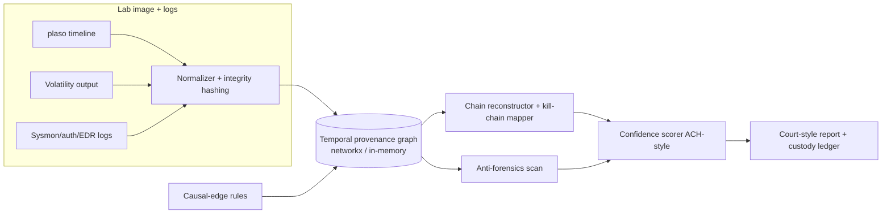

# REVENANT

> Evidence-graph forensic timeline reconstruction with confidence grading (DFIR).
> **Lab-only. Defensive/analytical.** No real exploit code, no third-party targeting.

**One-line.** A forensic timeline engine that ingests disk/memory/log artifacts,
fuses them into one **evidence graph**, and reconstructs *what happened* as a
confidence-graded narrative where every claim links back to the artifact that
supports it.

## Why

`plaso`/`log2timeline` produces a super-timeline of millions of undifferentiated
rows; an analyst still hand-builds the story. REVENANT treats forensic events as
nodes in a temporal **provenance graph**, infers typed causal edges under
temporal + entity constraints, reconstructs candidate incident chains mapped to
the cyber kill chain, and scores each chain's confidence from source
reliability, corroboration, and temporal fit. Output: ranked narratives with a
per-hop chain-of-custody trail and an explicit *what-remains-uncertain* section.

## Architecture



## Quickstart

```bash
pip install -r requirements.txt      # pydantic + networkx + pytest
make test                            # run the suite (31 tests)
make demo                            # reconstruct the built-in intrusion scenario
make demo-timestomp                  # anti-forensics: timestomp lowers confidence
```

CLI:

```bash
PYTHONPATH=src python -m revenant.cli scenarios
PYTHONPATH=src python -m revenant.cli demo --scenario intrusion
PYTHONPATH=src python -m revenant.cli analyze records.json   # [[kind, record], ...]
PYTHONPATH=src python -m revenant.cli verify  records.json   # custody-ledger integrity
```

Library:

```python
from revenant import run
from revenant.generators import intrusion_scenario
from revenant.report import generate_report

analysis = run(intrusion_scenario())
print(generate_report(analysis))
```

## What's built (this MVP)

| Component | Grade | Status |
| --- | --- | --- |
| Typed models / contracts (`models.py`) | A | done |
| Integrity hashing + append-only tamper-evident custody ledger | A | done |
| Normalizer (Sysmon / auth / plaso-style) | A | done |
| Temporal provenance graph (networkx + in-memory fallback) | A | done |
| Causal-edge rule engine (explainable, per-edge rule name) | A | done |
| Chain reconstructor + kill-chain mapper | A | done |
| Confidence scorer (reliability + corroboration + temporal fit) | A | done |
| Anti-forensics indicators (timestomp / hash-mismatch / log-gap) | A/D | done (heuristic) |
| Court-style Markdown report + uncertainty section | A | done |
| Synthetic data generators (4 scenarios) | A | done |
| CLI, Makefile, CI (SAST + dep + secret scan) | A/B | done |

## Prior art & how this differs

| Existing | What it does | Gap REVENANT targets |
| --- | --- | --- |
| plaso / log2timeline | Super-timeline extraction | Flat rows, no causality/confidence/narrative |
| Volatility 3 | Memory artifact extraction | Point artifacts, not a fused cross-source timeline |
| Autopsy / TSK | Disk forensics GUI | Manual analysis, no automated causal reconstruction |
| Timesketch (Google) | Collaborative timeline + some ML | No confidence-graded causal *narrative* with custody links |

**Honest gap:** Timesketch is the closest and it's excellent. REVENANT's
differentiator is *automated causal-chain inference + explicit confidence
grading (adapted from CTI's Admiralty/ACH credibility model) + a
machine-verifiable chain-of-custody on every derived claim*. It could run **on
top of** plaso/Timesketch output. Not novel: artifact parsing, super-timelines.

## Design stance on AI

The core is rules + graph on purpose: courts distrust black boxes, so
explainability is a design constraint. Every causal edge names the rule that
produced it; every report sentence cites a graph node. ML/LLM would only ever be
a *report-drafting assistant over already-derived facts* (never the source of a
causal claim) — deliberately out of scope for this MVP.

## Not in this MVP (documented TODO)

- **Grade B/C:** real plaso/psort + Volatility 3 connectors (shapes are stubbed
  in the normalizer); Neo4j persistence backend (optional `docker-compose.yml`
  included); WeasyPrint PDF export (Markdown report is the Grade-A output).
- **Grade C:** ingest of real DFIR CTF / NIST CFReDS corpora.
- **Grade D:** hardened anti-forensics heuristics (MFT vs `$LogFile`, `$UsnJrnl`
  cross-checks) — current detectors are demonstrative; React + vis-timeline UI.
- **Grade D:** building/infecting lab images (use public CTF images instead).

## Lab-only safety note

REVENANT is a defensive/analytical tool. It only *reads and reconstructs*
artifacts; it never mutates source evidence and generates no offensive code. All
bundled data is synthetic and benign. Use only on evidence you are authorized to
analyze, in isolated lab environments. See `SECURITY.md` and `THREAT_MODEL.md`.

## License

MIT.
