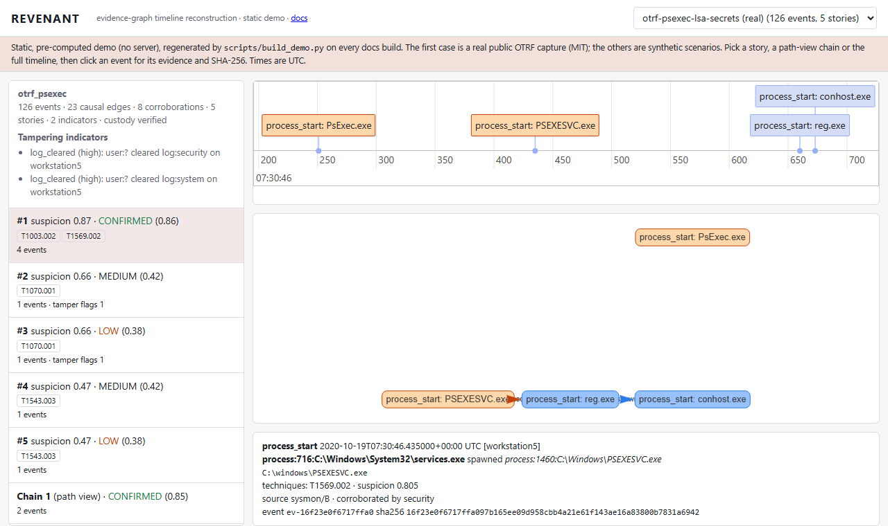
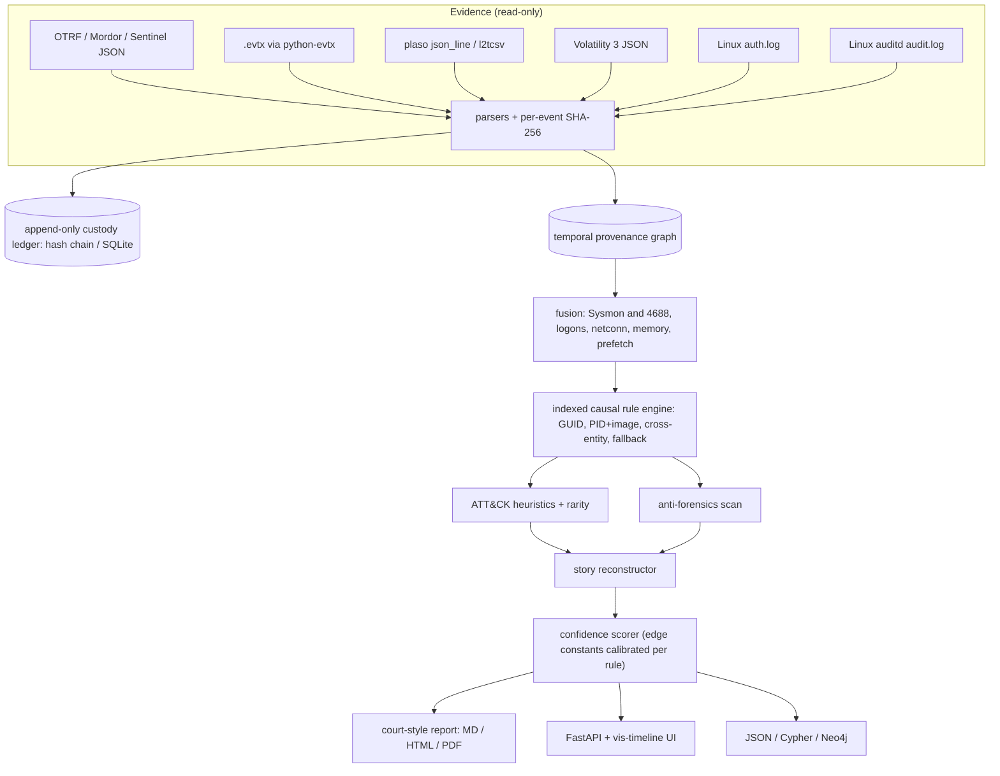

# REVENANT

[](https://github.com/rakshit-737/revenant/actions/workflows/ci.yml)
[](https://rakshit-737.github.io/revenant/)

[](LICENSE)


**Contribution:** REVENANT recovers *which process caused what* in forensic artefacts that
lack process GUIDs, using named, deterministic causal rules whose per-rule confidences are
calibrated against Sysmon-GUID lineage that is hidden at inference and tested on held-out
corpora; every narrative claim carries that confidence plus the SHA-256 of its evidence.
On 120 OTRF atomic captures (142k scored effects) it reaches causal-edge F1 **0.910**
(95% CI 0.80-0.98) against **0.822** (0.54-0.96) for a PID-nearest analyst baseline on the
same input; the [ablation](#b1-causal-edge-accuracy-against-sysmon-guid-ground-truth) shows
the gain comes from its image-keyed fallback rules.

[](https://rakshit-737.github.io/revenant/demo/)

**Documentation:** <https://rakshit-737.github.io/revenant/> · [Live demo](https://rakshit-737.github.io/revenant/demo/) ·
[Evaluation](https://rakshit-737.github.io/revenant/evaluation/) · [Reproduce](https://rakshit-737.github.io/revenant/reproduce/)

**Forensic timeline reconstruction for DFIR.** REVENANT reads real Windows and Linux
artefacts (Sysmon, Security, PowerShell, raw `.evtx`, plaso, Volatility 3, auth.log, auditd),
joins them into a temporal provenance graph, and outputs ranked incident stories
graded by confidence. Every claim cites the SHA-256 of the event that supports it,
and the stories are recorded in an append-only custody ledger.

> Lab-only and defensive. REVENANT reads evidence and never changes it. It contains
> no offensive code. All benchmark data is public (see [Datasets](#datasets)).

## Try it in 60 seconds

1. **No install:** open the [live demo](https://rakshit-737.github.io/revenant/demo/) (a real
   public OTRF capture, pre-computed).
2. **Docker** (published image):
   ```bash
   docker run --rm ghcr.io/rakshit-737/revenant:latest demo --scenario intrusion
   ```
3. **From source** (REVENANT is not on PyPI; `pip install revenant` is an unrelated package):
   ```bash
   pip install "git+https://github.com/rakshit-737/revenant"
   revenant demo --scenario intrusion
   ```

Expected first lines (synthetic phishing scenario):

```text
# REVENANT - Forensic Reconstruction Report
...
### story-907cbcd159 - suspicion 0.91, confidence HIGH (0.75)
```

## Headline results

| Benchmark (public data, ground truth) | REVENANT | Best baseline | Verdict |
|---|---|---|---|
| B1 causal edges, OTRF atomic (120 captures, Sysmon-GUID truth hidden) | F1 0.910 [0.80, 0.98] | PID-nearest 0.822 [0.54, 0.96] | better (paired CI of difference +0.005 to +0.296) |
| B1 causal edges, APT29 day 1 + day 2, LSASS (7), Log4Shell | F1 0.999-1.000 | PID-nearest 1.000 | no difference: these captures are easy |
| Edge calibration, fit APT29 -> test atomic | ECE 0.106 (hand-set 0.233), AUROC 0.78 | - | improved, not solved |
| B2 story ranking, 107 labelled captures, equal budget | hit@1 0.28 [0.21, 0.37] | flat suspicion-sorted 0.36 [0.28, 0.46] | **worse** (McNemar p=0.06) |
| B3 anti-forensics, 278 `.evtx`, 10 positives | P 0.20 / R 0.60 | 1102/104 query P 0.12 / R 0.30 | better recall, tiny sample |
| C ATLAS paper, from the authors' release | event F1 0.9988 (their `evaluate.py` re-run); entity F1 0.913 | paper: 0.9988 / 0.9376 | event level reproduced; entity level 2.4 points lower |
| Live auditd capture in CI (scripted benign sequence) | 7/7 chain checks, story rank 1 | - | consistency check, not accuracy |

Full tables with confidence intervals: [`results/RESULTS.md`](results/RESULTS.md) and the
[Evaluation page](https://rakshit-737.github.io/revenant/evaluation/).

---

## Why

`plaso`/`log2timeline` produces a super-timeline with millions of undifferentiated rows,
and an analyst still has to build the story by hand. REVENANT turns events into nodes and
adds typed causal edges ("process spawned process", "process wrote file",
"logon → session", "dropped file executed"). Each edge comes from a named, deterministic rule
with entity and time constraints. The graph is then cut into **incident stories**, and each
story gets two separate scores:

- **suspicion**: how attack-like it is, from ATT&CK heuristics and per-case rarity;
- **confidence**: how well the evidence supports it, from source reliability, cross-artefact
  corroboration, temporal fit and calibrated rule precision. Tampering indicators reduce it.

The report ends with a **"What remains uncertain"** section. It lists time windows with no
coverage, event types that were not interpreted, and unreadable artefacts, so that gaps are
not quietly filled in.

## Architecture



For the module map and trust boundaries, see [`docs/architecture.md`](docs/architecture.md). Design decisions are recorded in [`docs/adr/`](docs/adr).

## Results on real public data

All numbers come from `benchmarks/` on the public corpora in [Datasets](#datasets); the
corpus-scale runs execute on GitHub Actions (`bench-extended` workflow), where no endpoint
antivirus quarantines captures. Raw JSON is in [`results/`](results), the full tables with
95% CIs are in [`results/RESULTS.md`](results/RESULTS.md), and the ground truth and blind
spots of each benchmark are in [ADR 0006](docs/adr/0006-benchmark-methodology.md).
B1 CIs resample whole captures (cluster bootstrap); B2/B3 use Wilson intervals and exact
McNemar tests.

### B1: Causal-edge accuracy against Sysmon GUID ground truth

Sysmon's `ProcessGuid`/`ParentProcessGuid` is unique for each process instance, so a GUID
parent is the true cause. REVENANT runs **with GUIDs hidden** and has to recover each cause
from host, PID, image and time alone. Baselines run on the **same fused, de-duplicated
events** REVENANT sees (an earlier version compared against raw events, which inflated
REVENANT's margin; the old numbers are superseded).

| Corpus (captures with effects / effects) | Method | Precision | Recall | F1 [95% CI] | Macro F1 |
|---|---|---|---|---|---|
| OTRF atomic (102 / 142,175) | v0.1-style exact-ref join | 0.783 | 0.199 | 0.317 [0.19, 0.43] | 0.396 |
| | PID-nearest (flat timeline filtered by host+PID) | **0.942** | 0.729 | 0.822 [0.54, 0.96] | 0.737 |
| | **REVENANT** | 0.910 | **0.910** | **0.910** [0.80, 0.98] | **0.931** |
| OTRF APT29 day 1 (1 / 79,607) | PID-nearest | 1.000 | 1.000 | 1.000 | |
| | REVENANT | 1.000 | 1.000 | 1.000 | |
| OTRF APT29 day 2 (1 / 166,252) | PID-nearest / REVENANT | 1.000 | 1.000 | 1.000 / 1.000 | |
| OTRF LSASS campaign (7 / 24,055) | PID-nearest / REVENANT | 1.000 / 0.999 | 1.000 / 0.999 | 1.000 / 0.999 | |
| OTRF Log4Shell (1 / 193) | PID-nearest / REVENANT | 1.000 | 1.000 | 1.000 / 1.000 | |

**Ablation** (OTRF atomic, F1): full engine 0.910; without the image-only fallback rules
**0.826**; without image in the process key 0.906; without the PID-reuse guard 0.910; without
Sysmon/4688 fusion 0.848; PID-nearest 0.822. The gain over PID-nearest therefore comes almost
entirely from the **fallback rules**, which link an effect whose PID is missing (NXLog drops
Sysmon `ProcessId` on a share of rows) to the nearest earlier start of the same image; the
paired 95% CI of their contribution is +0.002 to +0.287. Fusion matters most on the LSASS
captures (0.793 without it). REVENANT trails PID-nearest on precision (0.910 vs 0.942)
because fallback links are less precise. The other four corpora are easy: no effect of an
older process occurs after its PID is reused, so PID-nearest is already perfect there (PIDs
*are* reused inside APT29 day 1). The atomic micro-average is dominated by registry writes
(100,512 effects) and three captures hold 56% of the effects, hence the macro F1 column.
Process-start edges alone score F1 0.680 (PID-nearest 0.663).


**Calibration.** Hand-set rule confidences were *under*-confident (accuracy above confidence
in every bin; ECE 0.23-0.30). Per-rule precision fitted on APT29 day 1 and tested on atomic
lowers ECE to **0.106** (Brier 0.098, AUROC 0.78); fitted on atomic and tested on the LSASS
captures, ECE is 0.027. Fitted on atomic and tested on APT29 the ECE is 0.032, but every
APT29 edge is correct, so that number only says the constants are close to 1. Shipped
constants are capped at 0.99. Story confidence and grades are *not* calibrated (see
[Limitations](#limitations)).


### B2: Story ranking against flat timelines (107 labelled OTRF atomic captures)

Every method gets the **same reading budget**: k x the capture's median story size. (An
earlier version gave REVENANT its top-k *whole* stories against a smaller budget for the flat
lists, which made stories look better; that comparison is withdrawn.)

| Method | hit@1 [95% CI] | hit@3 | hit@5 | story-unit hit@1 / @5 |
|---|---|---|---|---|
| Chronological super-timeline | 0.000 [0.00, 0.03] | 0.000 | 0.000 | 0.000 / 0.019 |
| Flat, suspicion-sorted (same heuristics, no graph) | **0.364** [0.28, 0.46] | 0.430 | **0.505** | 0.439 / 0.523 |
| REVENANT stories | 0.280 [0.20, 0.37] | 0.411 | 0.458 | 0.411 / 0.495 |

Stories do **not** reach the labelled technique faster than a suspicion-sorted flat list
with the same heuristics; they are slightly worse (hit@1: 5 captures REVENANT-only vs 14
flat-only, exact McNemar p=0.064; hit@5 p=0.063; not significant at 0.05). The story-unit
view, where the flat list reads exactly as many events as REVENANT's top-k stories, shows the
same. What stories add is grouping, per-hop explanation and confidence, not faster triage.


### B3: Anti-forensics on EVTX-ATTACK-SAMPLES (278 raw `.evtx` files, file-level)

| Detector | Precision [95% CI] | Recall [95% CI] | F1 |
|---|---|---|---|
| 1102/104 "log cleared" query (standard SIEM rule) | 0.115 [0.04, 0.29] | 0.300 [0.11, 0.60] | 0.167 |
| REVENANT (timestomp, log clearing, audit/logging tamper, clock, record order) | 0.200 [0.10, 0.37] | 0.600 [0.31, 0.83] | 0.300 |

Only 10 files are positive, so the intervals overlap. The sample author cleared logs before
recording many "negative" samples, so 1102 events really appear in them: 23 of REVENANT's 24
false-positive files are the same 1102/104 hits as the baseline. The extra true positives are
2 timestomp files (invisible to a 1102 query) and 1 PowerShell script-block-logging disable
(new pattern this release). The 4 misses are 3 event-log service crashes (System 7036) and 1
MRU key delete, which are not modelled yet.

### B4: Scale (full APT29 day 1 capture)

- 196,081 raw rows → **128,095 events**, **93,974 causal edges**, **1,475 cross-artefact
  corroborations**, 50 stories, 209 tamper or coverage indicators
- Analysis of pre-parsed events (JSON parsing excluded) in **108 s**, about 1,180 events/s on
  one laptop core; single run on a machine with other work running. Stage times: ingest 15 s,
  fusion 7 s, rules 28 s, anti-forensics 31 s, stories 26 s
- The rule engine's log-log slope fell from **2.18 (v0.1, quadratic)** to **1.03 (v0.2, indexed)**.


### B5: Live kernel capture in CI (auditd)

The `live-auditd` CI job (weekly and on every push, ubuntu-24.04) starts auditd inside the
runner, records benign background load plus a scripted stage → fetch (127.0.0.1 only) →
archive → delete sequence on dummy files, and reconstructs it with
`revenant analyze --kind auditd`. Latest run: 63 events; all 7 chain checks pass (spawn,
dropped file executed, connect to the peer, write, delete attributed, one story covering the
sequence); that story ranks first with coverage 0.86, grade HIGH; 25/25 inferred edges agree
with auditd's own pid/ppid fields. That agreement is close to circular (the parser reads the
same fields), so this is an **end-to-end consistency and regression check**, not an
independent accuracy measurement.

### C: Reproducing the ATLAS paper

ATLAS (Alsaheel et al., USENIX Security 2021) reports entity-level precision/recall/F1 of
91.06/97.29/93.76% over 10 attacks. The `atlas-repro` workflow downloads the authors'
release (pinned commit, git-blob and SHA-256 verified, no executables), recomputes every
attack's P/R/F1 from the released per-attack counts and averages them: **0.9106 / 0.9729 /
0.9376, identical to the paper** (the pooled micro-average is 0.9040 / 0.9715 / 0.9365; the
spreadsheet's pooled F1 cell reads 1, a spreadsheet error). It then runs the authors' own
`evaluate.py` (Python 3.7, offline container) on their released model outputs: event-level
P/R/F1 **0.9988 / 0.9989 / 0.9988, identical to the paper**; entity-level **0.879 / 0.963 /
0.913**, 2.4 F1 points below the paper, because the released script counts unique entities
differently from the spreadsheet (e.g. 11 vs 22 malicious entities for S-1). Released outputs
match the spreadsheet's event totals for 7 of 10 attacks (M-2, M-3, M-4 differ by 2-207 events
out of 258k-334k). Re-running the TensorFlow 2.3 model itself, retraining, and scoring REVENANT
under the ATLAS protocol are not done yet (see [Roadmap](#roadmap)); details are in
[`results/atlas_repro.json`](results/atlas_repro.json).

## Quickstart

Every command below runs as written from a clean checkout (CI runs this block verbatim).
REVENANT is **not on PyPI** -- `pip install revenant` installs an unrelated package.

<!-- quickstart -->
```bash
git clone https://github.com/rakshit-737/revenant && cd revenant
python -m pip install -e ".[dev,evtx,api]"          # core: pydantic + networkx; extras optional
python -m pytest -q                                  # committed fixtures; real-data tests skip without data

# analyse a real OTRF capture (committed, MIT, field-trimmed)
revenant analyze tests/fixtures/otrf_psexec_lsa_secrets.jsonl --top 3

# HTML report + append-only custody ledger, then verify the ledger (read-only)
revenant analyze tests/fixtures/otrf_psexec_lsa_secrets.jsonl --format html --out report.html --ledger custody.sqlite
revenant verify custody.sqlite
# plaso json_line -> Neo4j Cypher; Linux auditd log -> Markdown
revenant analyze tests/fixtures/plaso.jsonl --format cypher --out graph.cypher
revenant analyze tests/fixtures/auditd_sample.log --kind auditd --top 1
```

On your own evidence: `revenant analyze <file-or-dir> ...`. `--pdf report.pdf` needs
`pip install -e ".[pdf]"` (WeasyPrint). The API + timeline/graph UI binds to 127.0.0.1 and
is confined to an evidence root:
`REVENANT_EVIDENCE_ROOT=tests/fixtures revenant serve` then open <http://127.0.0.1:8000>.
To anchor a ledger, pass the "Ledger head" and record count printed in the report:
`revenant verify custody.sqlite --expect-head <hash> --expect-count <n>`.

Example (abridged) on the committed PsExec + LSA-secrets capture:

```text
### story-a65f65fb66 - suspicion 0.87, confidence CONFIRMED (0.86)
- Root: process:7256:C:\Users\wardog\Downloads\PSTools\PsExec.exe   Hosts: workstation5
- ATT&CK techniques: T1003.002, T1569.002
- Confidence breakdown: reliability 0.85, corroboration 0.70, temporal fit 1.00, edge strength 0.97
- ev-ae581d6f… cmd.exe spawned PsExec.exe `-accepteula -s reg save HKLM\security\policy\secrets …`
  [T1003.002] (corroborated by 1: security/sysmon) (source: sysmon/B, sha256:ae581d6f3272…)
- ev-16f23e0f… services.exe spawned PSEXESVC.exe [T1569.002] …
## Tampering indicators
- log_cleared (high): cleared log:security on workstation5 [ev-96c11084403ee1af]
```

Library use:

```python
from revenant.pipeline import analyze_paths
analysis = analyze_paths(["tests/fixtures/otrf_psexec_lsa_secrets.jsonl"])
print(analysis.stories[0].story_id, analysis.stories[0].grade.value)
```

## Reproducibility

Exact commands, expected numbers and runtimes are on the
[Reproduce page](https://rakshit-737.github.io/revenant/reproduce/). In short:

| Step | Command | Notes |
|---|---|---|
| Data | `python scripts/download_data.py` | ~100 MB compressed by default into `$REVENANT_DATA` (default `../../datasets/revenant`); every archive pinned by SHA-256 in `data/manifest.json`. Opt-in groups via `--only` (`otrf-lsass`, `otrf-log4shell`, `otrf-apt29-day2`: 43 MB compressed, 1.7 GB of JSON) |
| Corpus benchmarks | GitHub Actions → `bench-extended` (workflow_dispatch) | B1 on 5 corpora, B2, B3; about 5 min of benchmark time on an ubuntu runner. Locally: `cd benchmarks && python bench_edges.py --extra && python bench_stories.py && python bench_antiforensics.py` (needs `pip install -e ".[bench,evtx]"`) |
| ATLAS reproduction | GitHub Actions → `atlas-repro` | downloads the pinned ATLAS release (~0.85 GB) on the runner |
| Figures | `python benchmarks/make_figures.py` | needs the `bench` extra; regenerates `results/*.png`, `RESULTS.md`, `stats.json` |
| Real-data tests | `python -m pytest -m realdata` | skipped automatically when data is absent |
| Demo data | `python scripts/build_demo.py` | regenerates `docs/demo/cases/` (the docs workflow runs it) |

## Datasets

| Corpus | Used for | Size | Licence |
|---|---|---|---|
| [OTRF Security-Datasets](https://github.com/OTRF/Security-Datasets), atomic Windows captures (commit `d9d40ef`) | B1, B2, calibration | 120 unique captures listed, 102 with scorable effects, 498k events | MIT |
| OTRF APT29 ATT&CK Evaluations, day 1 and day 2 | B1, B4, calibration | 128k + 381k events | MIT |
| OTRF LSASS-dump campaign (7 captures, host logs only) and Log4Shell (Sentinel export) | B1, held-out calibration | 257k + 332 events | MIT |
| [EVTX-ATTACK-SAMPLES](https://github.com/sbousseaden/EVTX-ATTACK-SAMPLES) (commit `4ceed2f`) | B3, `.evtx` parser | 278 files, 61 MB | GPL-3.0 (input only, not redistributed) |
| [ATLAS](https://github.com/purseclab/ATLAS) release (commit `e46096d`) | C (paper reproduction) | 21 files, ~0.85 GB | Apache-2.0 |

Citations and practical notes (AV quarantine of attack-tool strings, macOS archive junk,
clock fields) are in [`docs/datasets.md`](docs/datasets.md). The only corpus data in git
is one field-trimmed OTRF capture used as a test fixture (MIT, attributed).

## What is implemented

| Spec component | Status |
|---|---|
| Ingest + per-event SHA-256 + custody | OTRF JSON (incl. Sentinel exports), `.evtx` (python-evtx + defusedxml), plaso `json_line`/`l2tcsv`, Volatility 3 JSON, auth.log, Linux auditd. Links inside evidence are never followed. Append-only SQLite ledger with UPDATE/DELETE triggers, read-only verification and external anchors |
| Normaliser | Pydantic actor-action-object schema. 21 Sysmon and 23 Security/System/PowerShell event ids. Clock-offset estimation for each capture (ADR 0007) |
| Provenance graph | networkx with an in-memory fallback. Export to JSON, Cypher, or live Neo4j |
| Causal rule engine | Indexed, O(n log n), with PID-reuse guard and GUID/PID/image/logon tiers, calibrated per rule (ADR 0002) |
| Cross-artefact fusion | Sysmon 1 ↔ 4688, 5 ↔ 4689, logons, network, memory `pslist`, prefetch |
| Chain reconstructor | Incident stories (ADR 0004) plus the v0.1 path view, mapped to ATT&CK and the kill chain |
| Confidence scorer | Weighted sum 0.3 reliability + 0.3 corroboration + 0.2 temporal fit + 0.2 edge strength, minus a tamper penalty; grade cut-offs 0.85 / 0.65 / 0.40 (hand-set) |
| Anti-forensics | Sysmon 2 timestomp, plaso `$SI`/`$FN` mismatch, 1102/104, audit/logging tamper (incl. PowerShell script-block logging), 4616 clock jumps, record-order checks |
| Report | Scope with artefact hashes, method, cited findings, tampering, "What remains uncertain", custody head. Markdown, HTML, or PDF (optional WeasyPrint) |
| API + UI | FastAPI, plus a single page with vis-timeline and vis-network (SRI-pinned). Loopback only, Host/Origin checks, 64 KiB body cap |

## Prior art and how this differs

| Existing | What it does | Where REVENANT differs |
|---|---|---|
| plaso / log2timeline | Super-timeline extraction | REVENANT **consumes** plaso output and adds causality, confidence and narratives |
| Volatility 3 | Memory artefact extraction | Its `pslist`/`netscan` output is fused with the logs as corroboration |
| Autopsy / TSK | Disk forensics GUI | No automated causal reconstruction |
| Timesketch | Collaborative timeline analysis with analyzers | Closest tool, and excellent. REVENANT's additions are calibrated causal edges, separate suspicion and confidence scores, and custody hashes on every derived claim |
| Sigma / Chainsaw / Hayabusa | Rule-based detection over EVTX | Point detections. REVENANT groups them causally and grades evidence strength. It could ingest their hits |
| ATLAS (Alsaheel et al., USENIX Security 2021) | Sequence-learning attack-story construction from Windows security, DNS and Firefox logs; 91.06% P / 97.29% R entity-level on 10 attacks | ATLAS learns which entities are attack-relevant from labelled attacks; REVENANT uses deterministic, named rules with calibrated confidences and custody hashes. We reproduce ATLAS's event-level numbers from its release (entity level 2.4 F1 points lower); a head-to-head under its protocol is on the roadmap |
| AIRTAG (Ding et al., USENIX Security 2023) | Unsupervised log-embedding attack investigation, compared with ATLAS on 19 scenarios | Same difference: learned relevance vs explainable rules with evidence hashes |
| Provenance-graph research (HOLMES, POIROT, NoDoze, BackTracker) | Provenance graphs over kernel audit data | REVENANT ingests auditd too, but its focus is ordinary DFIR artefacts without process GUIDs and courtroom explainability rather than detection |

## Limitations

- **Story confidence is not calibrated.** Edge constants are calibrated per rule against
  GUID truth, but story confidence is a hand-weighted sum with hand-set grade cut-offs, and
  the GUID rules used when Sysmon GUIDs are present keep hand-set confidences (0.95/0.97).
  No benchmark yet checks that CONFIRMED stories are correct more often than HIGH ones.
- **Stories do not speed up triage.** Under equal reading budgets they are slightly worse than
  a suspicion-sorted flat list (B2). B2 also uses REVENANT's own heuristics to decide "found",
  and the shipped calibration table was fitted on the same atomic captures B2 uses.
- The B1 gain over PID-nearest is one corpus (OTRF atomic) and comes from image-keyed
  fallback rules; the other four corpora show no difference. B1 covers process lineage and
  process→action edges only; cross-entity edges (dropped file executed, logon session) have no
  public ground truth beyond the live auditd consistency check.
- B3 has 10 positives and file-name labels; service-crash style log suppression and MRU
  deletes are not modelled.
- `.evtx` parsing through python-evtx is slow on Windows. Converting with `evtx_dump` first is
  much faster.
- REVENANT has not yet been scored under the ATLAS protocol; only ATLAS's own numbers are
  reproduced (from its released outputs, not by re-running its model).
- Anti-forensics checks on MFT against `$LogFile`/`$UsnJrnl` are limited to plaso's
  `$SI`/`$FN` fields. There is no raw NTFS parser.
- The LLM report-drafting assistant from the spec is intentionally not built. No claim
  comes from a model (ADR 0001).

## Roadmap

- [ ] Score REVENANT under the ATLAS protocol (symptom-seeded stories, ATLAS's `evaluate.py`), with a BackTracker-style reachability baseline
- [ ] Re-run ATLAS's released model (TensorFlow 2.3) and retrain with seeds
- [ ] Story-level confidence validation against labelled stories
- [ ] Event-log service-crash and MRU-deletion tamper indicators (the B3 misses)
- [ ] `evtx_dump` / Hayabusa JSON ingest for fast `.evtx` handling
- [ ] Timesketch importer/exporter
- [ ] PostgreSQL custody backend

## Design stance on AI

The core uses rules and a graph on purpose. Courts distrust black boxes, so explainability is
a design constraint. Every edge names the rule that produced it, and every report line cites
an event id and hash. The only learned part is the per-rule calibration table, which is fitted
from public ground truth and shipped as readable JSON.

## Project docs

[CHANGELOG](CHANGELOG.md) · [CONTRIBUTING](CONTRIBUTING.md) · [SECURITY](SECURITY.md) ·
[THREAT_MODEL](THREAT_MODEL.md) · [Architecture](docs/architecture.md) · [ADRs](docs/adr)

## Licence

MIT, see [LICENSE](LICENSE). Dataset licences are listed above and apply to the data, not to this code.
