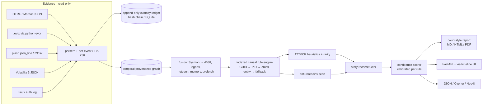
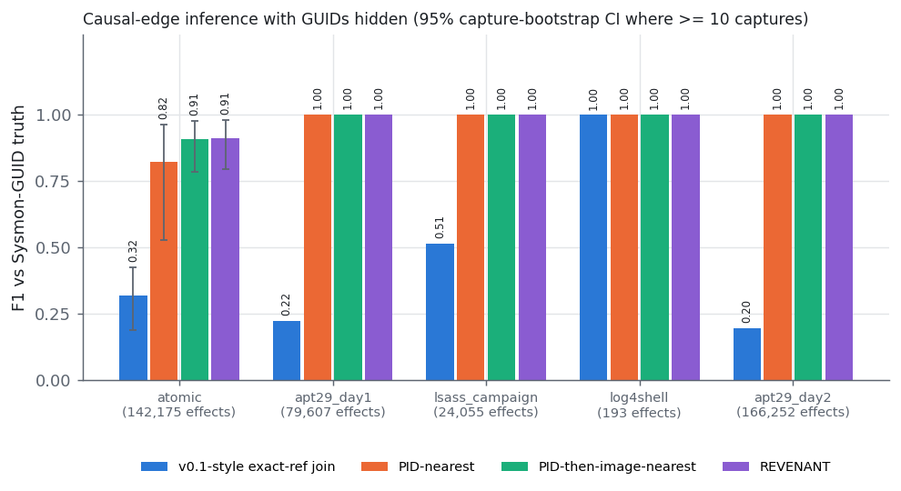
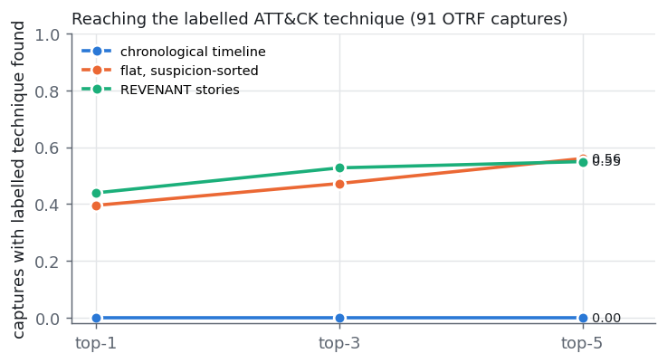
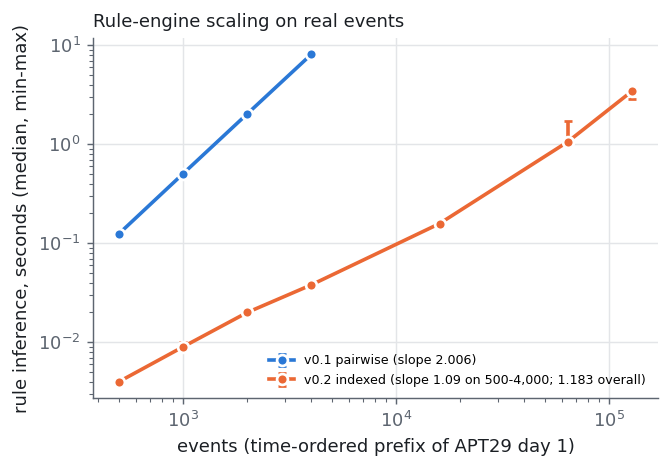

# REVENANT

[](https://github.com/rakshit-737/revenant/actions/workflows/ci.yml)
[](https://rakshit-737.github.io/revenant/)

[](LICENSE)


**Documentation:** <https://rakshit-737.github.io/revenant/> · [Live demo](https://rakshit-737.github.io/revenant/demo/)

**Forensic timeline reconstruction for DFIR.** REVENANT reads real Windows and Linux
artefacts (Sysmon, Security, PowerShell, raw `.evtx`, plaso, Volatility 3, auth.log),
joins them into a temporal provenance graph, and outputs ranked incident stories
graded by confidence. Every claim cites the SHA-256 of the event that supports it,
and the stories are recorded in an append-only custody ledger.

> Lab-only and defensive. REVENANT reads evidence and never changes it. It contains
> no offensive code. All benchmark data is public (see [Datasets](#datasets)).

---

## Why

`plaso`/`log2timeline` produces a super-timeline with millions of undifferentiated rows,
and an analyst still has to build the story by hand. REVENANT turns events into nodes and
adds typed causal edges ("process spawned process", "process wrote file",
"logon → session", "dropped file executed"). Each edge comes from a named, deterministic rule
with entity and time constraints. The graph is then cut into **incident stories**, and each
story gets two separate scores:

- **suspicion**: how attack-like it is, from ATT&CK heuristics and per-case rarity;
- **confidence**: how well the evidence supports it, from source reliability, cross-artefact
  corroboration, temporal fit and calibrated rule precision. Tampering indicators reduce it.

The report ends with a **"What remains uncertain"** section. It lists time windows with no
coverage, event types that were not interpreted, and unreadable artefacts, so that gaps are
not quietly filled in.

## Architecture



For the module map and trust boundaries, see [`docs/architecture.md`](docs/architecture.md). Design decisions are recorded in [`docs/adr/`](docs/adr).

## Results on real public data

All numbers below come from `benchmarks/` running on the public corpora described in
[Datasets](#datasets). Raw JSON is in [`results/`](results) and the full tables are in
[`results/RESULTS.md`](results/RESULTS.md). The ground truth for each benchmark and its blind
spot are described in [ADR 0006](docs/adr/0006-benchmark-methodology.md).

### B1: Causal-edge accuracy against Sysmon GUID ground truth

Sysmon's `ProcessGuid`/`ParentProcessGuid` is unique for each process instance, so a GUID
parent is the true cause. REVENANT runs **with GUIDs hidden** and has to recover each cause
from host, PID, image and time alone.

| Corpus (effects scored) | Method | Precision | Recall | F1 | False-edge rate |
|---|---|---|---|---|---|
| OTRF atomic, 119 captures (66,225) | v0.1 exact-ref join | 0.518 | 0.236 | 0.324 | 0.482 |
| | PID-nearest (flat timeline filtered by host+PID) | **0.957** | 0.846 | 0.898 | **0.043** |
| | **REVENANT v0.2** | 0.955 | **0.955** | **0.955** | 0.045 |
| OTRF APT29 day 1 (79,607) | v0.1 exact-ref join | 0.500 | 0.126 | 0.202 | 0.500 |
| | PID-nearest | 1.000 | 1.000 | 1.000 | 0.000 |
| | **REVENANT v0.2** | 1.000 | 1.000 | 1.000 | 0.000 |

On OTRF atomic, recall rises by 11 points over PID-nearest at the same precision. The largest
gains are on network connections (F1 0.73 → 0.96), DNS (0.80 → 0.95) and process starts
(0.80 → 0.88). APT29 day 1 turns out to be easy: it has no PID reuse inside the capture, so
PID-nearest is already perfect.



**Calibration.** Hand-set rule confidences were badly over-confident (ECE 0.25–0.27). Per-rule
precision fitted on one corpus and tested on the other brings ECE down to **0.013–0.035**
([`rule_calibration.json`](src/revenant/data/rule_calibration.json)).


### B2: Story ranking against flat timelines (OTRF atomic, ATT&CK labels from dataset metadata)

| Method | hit@1 | hit@3 | hit@5 | Captures reached | Median events read before evidence |
|---|---|---|---|---|---|
| Chronological super-timeline (plaso/psort reading order) | 0.000 | 0.000 | 0.000 | 54/91 | 204 |
| Flat, suspicion-sorted (same heuristics, no graph) | 0.396 | 0.472 | **0.560** | 54/91 | 0 |
| **REVENANT stories** | **0.440** | **0.527** | 0.549 | 51/91 | 1 |

Stories help at hit@1 and hit@3, but the gain over a suspicion-sorted flat list is modest, and
hit@5 is slightly worse. Three captures lose their labelled evidence when it falls outside any
story. Most of the benefit comes from the ATT&CK heuristics. The graph's main contribution is
the grouping and per-hop explanation. Headline ranking gains are small.



### B3: Anti-forensics on EVTX-ATTACK-SAMPLES (278 raw `.evtx` files, file-level)

| Detector | Precision | Recall | F1 |
|---|---|---|---|
| 1102/104 "log cleared" query (standard SIEM rule) | 0.115 | 0.300 | 0.167 |
| **REVENANT** (timestomp, log clearing, audit/logging tamper, clock, record order) | **0.172** | **0.500** | **0.256** |

Precision is low for both detectors. The sample author cleared logs before recording many
"negative" samples, so 1102 events really do appear in those files. The five missed positives
are event-log *service crashes* (System 7036 and similar) and an MRU key delete, which REVENANT
does not yet model. The parser processed 37,364 records. 58% of records in supported
channels were mapped. Most unmapped records come from a single ETW RPC trace.

### B4: Scale (full APT29 day 1 capture)

- 196,081 raw rows → **128,095 events**, **93,974 causal edges**, **1,475 cross-artefact
  corroborations**, 50 stories, 209 tamper or coverage indicators
- End to end in **108 s** (about 1,180 events/s, one core, laptop CPU). Stage times: ingest 15 s, fusion 7 s, rules 28 s,
  anti-forensics 31 s, stories 26 s
- The rule engine's log-log slope fell from **2.18 (v0.1, quadratic)** to **1.03 (v0.2, indexed)**.
  At full size v0.1 would need about 67 hours (extrapolated).



The top-ranked APT29 story on `scranton` groups T1021.003 (DCOM), T1059.001 (PowerShell) and
T1071.001 (C2 over HTTP) with CONFIRMED confidence. The second story adds T1003.001 (LSASS
access) and T1055 (injection).

## Quickstart

```bash
git clone https://github.com/rakshit-737/revenant && cd revenant
python -m pip install -e ".[dev,evtx,api]"         # core: pydantic + networkx; extras optional
python -m pytest -q                                 # 73 tests on committed fixtures (+4 realdata)

# analyse a real OTRF capture (committed, MIT, field-trimmed)
PYTHONPATH=src python -m revenant.cli analyze tests/fixtures/otrf_psexec_lsa_secrets.jsonl --top 3

# other formats / outputs
PYTHONPATH=src python -m revenant.cli analyze capture.evtx --format html --out report.html
PYTHONPATH=src python -m revenant.cli analyze capture.jsonl --ledger custody.sqlite --pdf report.pdf
PYTHONPATH=src python -m revenant.cli analyze plaso.jsonl --format cypher --out graph.cypher
PYTHONPATH=src python -m revenant.cli verify custody.sqlite

# API + timeline/graph UI on http://127.0.0.1:8000 (confined to an evidence root)
REVENANT_EVIDENCE_ROOT=tests/fixtures PYTHONPATH=src python -m revenant.cli serve
```

Example (abridged) on the committed PsExec + LSA-secrets capture:

```text
### story-a65f65fb66 - suspicion 0.87, confidence CONFIRMED (0.86)
- Root: process:7256:C:\Users\wardog\Downloads\PSTools\PsExec.exe   Hosts: workstation5
- ATT&CK techniques: T1003.002, T1569.002
- Confidence breakdown: reliability 0.85, corroboration 0.70, temporal fit 1.00, edge strength 0.97
- ev-ae581d6f… cmd.exe spawned PsExec.exe `-accepteula -s reg save HKLM\security\policy\secrets …`
  [T1003.002] (corroborated by 1: security/sysmon) (source: sysmon/B, sha256:ae581d6f3272…)
- ev-16f23e0f… services.exe spawned PSEXESVC.exe [T1569.002] …
## Tampering indicators
- log_cleared (high): cleared log:security on workstation5 [ev-96c11084403ee1af]
```

Library use:

```python
from revenant.pipeline import analyze_paths
analysis = analyze_paths(["capture.jsonl"])     # see src/revenant/pipeline.py
```

## Reproducibility

`make` is optional. Each target runs a single command:

| Step | Command | Notes |
|---|---|---|
| Data | `python scripts/download_data.py` | under 1 GB compressed (~2.4 GB on disk incl. extracted), into `../../datasets/revenant` (`$REVENANT_DATA`). SHA-256 pinned in `data/manifest.json` |
| Bench | `cd benchmarks && python bench_edges.py --write-calibration && python bench_stories.py && python bench_antiforensics.py && python bench_scale.py` | about 1 h total on a laptop. `.evtx` parsing is the slow part |
| Figures | `python benchmarks/make_figures.py` | regenerates `results/*.png` and `RESULTS.md` |
| Real-data tests | `python -m pytest -m realdata` | skipped automatically when data is absent (CI) |
| Demo | `python -m revenant.cli demo --scenario intrusion` | synthetic scenario from v0.1 |

## Datasets

| Corpus | Used for | Size | Licence |
|---|---|---|---|
| [OTRF Security-Datasets](https://github.com/OTRF/Security-Datasets), atomic Windows captures (commit `d9d40ef`) | B1, B2, calibration | 121 archives, ~2 GB extracted, 394k events | MIT |
| OTRF APT29 ATT&CK Evaluations, day 1 | B1, B4 | 196k raw rows | MIT |
| [EVTX-ATTACK-SAMPLES](https://github.com/sbousseaden/EVTX-ATTACK-SAMPLES) (commit `4ceed2f`) | B3, `.evtx` parser | 278 files, 61 MB | GPL-3.0 (input only, not redistributed) |

Citations and practical notes (AV quarantine of attack-tool strings, macOS archive junk,
clock fields) are in [`docs/datasets.md`](docs/datasets.md). The only corpus data in git
is one field-trimmed OTRF capture used as a test fixture (MIT, attributed).

## What is implemented

| Spec component | Status |
|---|---|
| Ingest + per-event SHA-256 + custody | OTRF JSON, `.evtx` (python-evtx + defusedxml), plaso `json_line`/`l2tcsv`, Volatility 3 JSON, auth.log. Append-only SQLite ledger with UPDATE/DELETE triggers and offline verification |
| Normaliser | Pydantic actor-action-object schema. 21 Sysmon and 23 Security/System/PowerShell event ids. Clock-offset estimation for each capture (ADR 0007) |
| Provenance graph | networkx with an in-memory fallback. Export to JSON, Cypher, or live Neo4j |
| Causal rule engine | Indexed, O(n log n), with PID-reuse guard and GUID/PID/image/logon tiers, calibrated per rule (ADR 0002) |
| Cross-artefact fusion | Sysmon 1 ↔ 4688, 5 ↔ 4689, logons, network, memory `pslist`, prefetch |
| Chain reconstructor | Incident stories (ADR 0004) plus the v0.1 path view, mapped to ATT&CK and the kill chain |
| Confidence scorer | Reliability × corroboration × temporal fit × edge strength, with tamper penalty |
| Anti-forensics | Sysmon 2 timestomp, plaso `$SI`/`$FN` mismatch, 1102/104, audit/logging tamper, 4616 clock jumps, record-order checks |
| Report | Scope with artefact hashes, method, cited findings, tampering, "What remains uncertain", custody head. Markdown, HTML, or PDF (optional WeasyPrint) |
| API + UI | FastAPI, plus a single page with vis-timeline and vis-network (SRI-pinned), bound to localhost |

## Prior art and how this differs

| Existing | What it does | Where REVENANT differs |
|---|---|---|
| plaso / log2timeline | Super-timeline extraction | REVENANT **consumes** plaso output and adds causality, confidence and narratives |
| Volatility 3 | Memory artefact extraction | Its `pslist`/`netscan` output is fused with the logs as corroboration |
| Autopsy / TSK | Disk forensics GUI | No automated causal reconstruction |
| Timesketch | Collaborative timeline analysis with analyzers | Closest tool, and excellent. REVENANT's additions are calibrated causal edges, separate suspicion and confidence scores, and custody hashes on every derived claim |
| Sigma / Chainsaw / Hayabusa | Rule-based detection over EVTX | Point detections. REVENANT groups them causally and grades evidence strength. It could ingest their hits |
| Provenance-graph research (e.g. HOLMES, POIROT, NoDoze) | Provenance graphs built from kernel audit data | REVENANT works with ordinary DFIR artefacts rather than a whole-system audit feed, and puts courtroom explainability ahead of detection |

## Limitations

- B1 covers process lineage and process→action edges only. Cross-entity edges (dropped file
  executed, logon session) have no public ground truth, so they are untested.
- B2 uses REVENANT's own heuristics to decide "found", so it measures ranking and grouping,
  not detection quality. The gain over a flat suspicion-sorted list is small.
- B3 precision is low, and the labels come from file names. Service-crash style log
  suppression is not modelled.
- `.evtx` parsing through python-evtx is slow (about 21 records/s on the benchmark machine
  while it was loaded). Converting to JSON first with `evtx_dump` is much faster.
- No published numbers exist for these exact tasks on these corpora. The comparisons are
  against baselines only.
- Anti-forensics checks on MFT against `$LogFile`/`$UsnJrnl` are limited to plaso's
  `$SI`/`$FN` fields. There is no raw NTFS parser.
- The LLM report-drafting assistant from the spec is intentionally not built. No claim
  comes from a model (ADR 0001).

## Roadmap

- [ ] `evtx_dump` / Hayabusa JSON ingest for fast `.evtx` handling
- [ ] Event-log service-crash and MRU-deletion tamper indicators (the B3 misses)
- [ ] Labelled cross-entity edges from a self-captured lab scenario
- [ ] Timesketch importer/exporter
- [ ] PostgreSQL custody backend

## Design stance on AI

The core uses rules and a graph on purpose. Courts distrust black boxes, so explainability is
a design constraint. Every edge names the rule that produced it, and every report line cites
an event id and hash. The only learned part is the per-rule calibration table, which is fitted
from public ground truth and shipped as readable JSON.

## Project docs

[CHANGELOG](CHANGELOG.md) · [CONTRIBUTING](CONTRIBUTING.md) · [SECURITY](SECURITY.md) ·
[THREAT_MODEL](THREAT_MODEL.md) · [Architecture](docs/architecture.md) · [ADRs](docs/adr)

## Licence

MIT, see [LICENSE](LICENSE). Dataset licences are listed above and apply to the data, not to this code.
