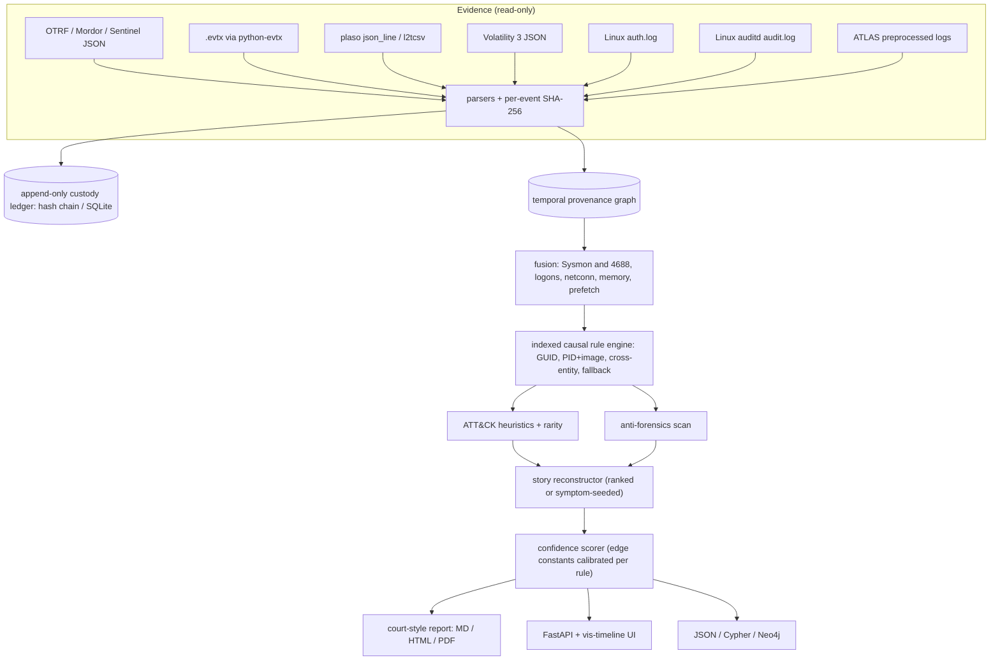

# REVENANT

**Forensic timeline reconstruction for DFIR: causal incident stories from Windows and Linux
artefacts, every claim graded and cited by the SHA-256 of its evidence.**

**Contribution:** REVENANT builds a causal provenance graph from forensic artefacts that lack
process GUIDs using named, deterministic rules whose per-rule confidences are fitted against
Sysmon-GUID lineage hidden at inference, and attaches the rule, its confidence and the hash of
the supporting event to every claim it reports.

[](https://github.com/rakshit-737/revenant/actions/workflows/ci.yml)
[](https://rakshit-737.github.io/revenant/)

[](LICENSE)


[](https://rakshit-737.github.io/revenant/demo/)

**What the evidence shows.** With GUIDs hidden, REVENANT's causal edges beat a PID-nearest
analyst baseline on OTRF atomic but are at parity with a careful PID-then-image heuristic;
calibration lowers the error of its edge confidences without improving their ranking; its
stories do not speed up triage; and under the ATLAS protocol it scores far below ATLAS's
hand-cleaned output. What it adds is explainability and custody, not accuracy. Every number
below carries a 95% interval or a test and the workflow run that produced it.

**Documentation:** <https://rakshit-737.github.io/revenant/> · [Live demo](https://rakshit-737.github.io/revenant/demo/) ·
[Evaluation](https://rakshit-737.github.io/revenant/evaluation/) · [Reproduce](https://rakshit-737.github.io/revenant/reproduce/)

## Headline results

<!-- headline:start -->
| Benchmark (public data, ground truth) | REVENANT | Best baseline | Verdict | Source run |
|---|---|---|---|---|
| B1 causal edges, OTRF atomic (120 captures, 102 with scorable effects; Sysmon GUIDs hidden as a proxy for GUID-less sources) | F1 0.910 [0.79, 0.98]; macro 0.931 | PID-then-image-nearest 0.906 [0.78, 0.97]; macro 0.923 | macro difference vs PID-nearest +0.194 [+0.129, +0.266], sign test p=4.6e-07; vs PID-then-image +0.008 [-0.000, +0.025], p=0.289 | [37093169942](https://github.com/rakshit-737/revenant/actions/runs/37093169942) |
| B1, APT29 day 1 + day 2, LSASS (7), Log4Shell | F1 0.999-1.000 | PID-nearest 1.000-1.000 | no difference (fewer than 10 captures per corpus: no CI) | [37093169942](https://github.com/rakshit-737/revenant/actions/runs/37093169942) |
| Edge calibration, fit APT29 -> test atomic | ECE 0.098 [0.011, 0.260], AUROC 0.66 [0.42, 0.94] | hand-set ECE 0.233 [0.179, 0.300] | improved, not solved | [37093169942](https://github.com/rakshit-737/revenant/actions/runs/37093169942) |
| B2 story ranking, 107 labelled captures, equal budget | hit@1 0.28 [0.20, 0.37] | flat suspicion-sorted 0.36 [0.28, 0.46] | lower, not significant (McNemar p=0.064) | [37093169942](https://github.com/rakshit-737/revenant/actions/runs/37093169942) |
| B3 anti-forensics, EVTX-ATTACK-SAMPLES (10 positives) | recall 0.80 [0.49, 0.94], precision 0.25 [0.13, 0.42] | 1102/104 recall 0.30; Sigma-equivalent recall 0.60, precision 0.20 | vs Sigma-equivalent on positives 2/0 discordant, p=0.500 | [37093169942](https://github.com/rakshit-737/revenant/actions/runs/37093169942) |
| B3b anti-forensics, OTRF T1562.002 captures (17 positives) | recall 1.00 [0.82, 1.00], precision 0.29 [0.19, 0.42] | 1102/104 recall 0.29; Sigma-equivalent recall 1.00, precision 0.29 | vs Sigma-equivalent on positives 0/0 discordant, p=1.000 | [37093169942](https://github.com/rakshit-737/revenant/actions/runs/37093169942) |
| C ATLAS paper, authors' release and `evaluate.py` | event F1 0.9988, entity F1 0.913; model re-run (TF 2.3) identical predictions on 15/16 test graphs | paper 0.9988 / 0.9376 | recomputed: macro event figures match Table 4's average; per-attack event counts differ for 8 of 10 attacks | [37090608948](https://github.com/rakshit-737/revenant/actions/runs/37090608948) |
| C2 REVENANT under the ATLAS protocol (10 attacks) | entity F1 0.556 [0.46, 0.64], event F1 0.574 [0.49, 0.65] | ATLAS (hand-cleaned) 0.913 / 0.9988 | **worse** on 10/10 attacks (sign test p=0.002) | [37090608948](https://github.com/rakshit-737/revenant/actions/runs/37090608948) |
| B5 live auditd capture in CI (scripted benign sequence) | 7/7 chain checks; 25/25 edges agree [0.86, 1.00] | - | consistency check, not accuracy | [37093169673](https://github.com/rakshit-737/revenant/actions/runs/37093169673) |
<!-- headline:end -->

The table is generated by `benchmarks/make_figures.py` from the committed
[`results/*.json`](results); full tables with every interval are in
[`results/RESULTS.md`](results/RESULTS.md) and on the
[Evaluation page](https://rakshit-737.github.io/revenant/evaluation/).

> Lab-only and defensive. REVENANT reads evidence and never changes it. It contains no
> offensive code. All benchmark data is public (see [Datasets](#datasets)).

## Try it in 60 seconds

1. **No install:** open the [live demo](https://rakshit-737.github.io/revenant/demo/) (a real
   public OTRF capture, pre-computed).
2. **From source (recommended)** (REVENANT is not on PyPI; `pip install revenant` is an unrelated package):
   ```bash
   pip install "git+https://github.com/rakshit-737/revenant"
   revenant demo --scenario intrusion
   ```
3. **Docker** (published image; tags `:latest`, `:1.1.2`, `:1.1`, and from v1.1.2 on also the git tag, e.g. `:v1.1.2`):
   ```bash
   docker run --rm ghcr.io/rakshit-737/revenant:latest demo --scenario intrusion
   ```
   > Images from v1.1.0 on ship the calibration table; v1.0.0 (`:1.0.0`) did not, so avoid it.

Expected first lines (synthetic phishing scenario):

```text
# REVENANT - Forensic Reconstruction Report
...
### story-907cbcd159 - suspicion 0.91, confidence HIGH (0.74)
```

---

## Why

`plaso`/`log2timeline` produces a super-timeline with millions of undifferentiated rows,
and an analyst still has to build the story by hand. REVENANT turns events into nodes and
adds typed causal edges ("process spawned process", "process wrote file",
"logon → session", "dropped file executed"). Each edge comes from a named, deterministic rule
with entity and time constraints. The graph is then cut into **incident stories**, and each
story gets two separate scores:

- **suspicion**: how attack-like it is, from ATT&CK heuristics and per-case rarity;
- **confidence**: how well the evidence supports it, from source reliability, cross-artefact
  corroboration, temporal fit and calibrated rule precision. Tampering indicators reduce it.

The report ends with a **"What remains uncertain"** section. It lists time windows with no
coverage, event types that were not interpreted, and unreadable artefacts, so that gaps are
not quietly filled in.

## Architecture



For the module map and trust boundaries, see [`docs/architecture.md`](docs/architecture.md). Design decisions are recorded in [`docs/adr/`](docs/adr).

## Results on real public data

All numbers come from `benchmarks/` on the public corpora in [Datasets](#datasets). The
corpus-scale runs execute on GitHub Actions (`bench-extended` and `atlas-repro`), where no
endpoint antivirus quarantines captures, and every result file records the run and commit
that produced it. The ground truth and blind spots of each benchmark are in
[ADR 0006](docs/adr/0006-benchmark-methodology.md). Intervals: B1 resamples whole captures
(10,000 resamples, seed 7) with paired sign and Wilcoxon tests; B2/B3/B3b use Wilson
intervals and exact McNemar tests; B5 uses Clopper-Pearson; C2 bootstraps over the 10 attacks.

### B1: Causal-edge accuracy against Sysmon GUID ground truth

Sysmon's `ProcessGuid`/`ParentProcessGuid` is unique for each process instance, so a GUID
parent is the true cause. Every method runs **with GUIDs hidden** and has to recover each cause
from host, PID, image and time alone, on the **same fused, de-duplicated events**. This is a
proxy for GUID-less sources: the Sysmon events keep their PID and image.

On OTRF atomic (102 captures with effects, 142,175 effects; run
[37093169942](https://github.com/rakshit-737/revenant/actions/runs/37093169942)):

| Method | F1 [95% CI] | macro F1 [95% CI] | REVENANT macro difference [95% CI], sign test |
|---|---|---|---|
| v0.1-style exact-ref join | 0.317 [0.19, 0.43] | 0.396 [0.33, 0.46] | |
| PID-nearest (flat timeline filtered by host+PID) | 0.822 [0.53, 0.96] | 0.737 [0.65, 0.82] | +0.194 [+0.129, +0.266], better on 29 captures, worse on 2, p = 4.6e-7 |
| PID-then-image-nearest (same, plus nearest start of the same image when the PID is missing) | 0.906 [0.78, 0.97] | 0.923 [0.88, 0.96] | +0.008 [-0.000, +0.025], 6 vs 2, p = 0.29 |
| **REVENANT** | **0.910** [0.79, 0.98] | **0.931** [0.89, 0.96] | |

**Ablation** (macro F1 difference of the full engine over each variant): without the image-only
fallback rules +0.186 [+0.122, +0.258] (p = 7.9e-9); without Sysmon/4688 fusion +0.248
[+0.183, +0.315] (p = 5.7e-14); without image in the process key +0.008 [-0.000, +0.024]
(p = 0.45); without the PID-reuse guard +0.000 (p = 0.69). The gain over PID-nearest therefore
comes from the **fallback rules**, which link an effect whose PID is missing (NXLog drops Sysmon
`ProcessId` on a share of rows) to the nearest earlier start of the same image, and that idea is
exactly what the PID-then-image heuristic implements: REVENANT is not significantly better than
it. The three largest captures hold 56% of the effects; without them micro F1 is 0.859 vs 0.805
for PID-nearest. APT29 day 1 and day 2, the 7 LSASS captures and Log4Shell are easy for
PID-based methods (PID-nearest, PID-then-image and REVENANT about 1.0; the v0.1-style join
0.18-0.51 on APT29 and LSASS; fewer than 10 captures each, so no CI).


**Calibration.** Hand-set rule confidences were mostly *under*-confident (ECE 0.233 [0.179,
0.300] on atomic). Per-rule precision fitted on APT29 day 1 and tested on atomic lowers ECE to
**0.098** [0.011, 0.260] (capture bootstrap), but AUROC falls to 0.66 [0.42, 0.94] (hand-set
0.77), and keeping only the highest-confidence edges gains no precision (every selective-prediction
CI includes 0): the constants fix what a confidence *means*, not *which* edges are right. On the
rules the APT29 table covers, ECE is 0.043; 32,191 atomic edges come from rules it does not cover
and keep hand-set values. The table REVENANT ships is refitted in that run on all atomic captures
(its SHA-256 and run id are in `rule_calibration.json` and `results/edges.json`); its held-out
ECE is 0.040 on APT29 day 1, 0.034 on LSASS, 0.057 on APT29 day 2 and 0.012 on Log4Shell (point
estimates, under 10 captures each), **higher** than the stale table it replaces
(0.021/0.019/0.027/0.011). Constants are capped at 0.99 when loaded. Story confidence and grades
are *not* calibrated (see [Limitations](#limitations)).


### B2: Story ranking against flat timelines (107 labelled OTRF atomic captures)

Every method gets the **same reading budget**: k x the capture's median story size.

| Method | hit@1 [95% CI] | hit@3 [95% CI] | hit@5 [95% CI] |
|---|---|---|---|
| Chronological super-timeline | 0.000 [0.00, 0.03] | 0.000 [0.00, 0.03] | 0.000 [0.00, 0.03] |
| Flat, suspicion-sorted (same heuristics, no graph) | **0.364** [0.28, 0.46] | **0.430** [0.34, 0.52] | **0.505** [0.41, 0.60] |
| REVENANT stories | 0.280 [0.20, 0.37] | 0.411 [0.32, 0.51] | 0.458 [0.37, 0.55] |

Stories do **not** reach the labelled technique faster than a suspicion-sorted flat list with
the same heuristics; hit@1 is lower but not significantly (5 captures REVENANT-only vs 14
flat-only, exact McNemar p = 0.064; hit@5 p = 0.062). What stories add is grouping, per-hop
explanation and confidence, not faster triage (run
[37093169942](https://github.com/rakshit-737/revenant/actions/runs/37093169942)).


### B3 and B3b: Anti-forensics

**B3** scores 278 raw `.evtx` files from EVTX-ATTACK-SAMPLES, 10 of them labelled by file name as
log or timestamp tampering. **B3b** uses the dataset authors' own ATT&CK labels instead: the 17
OTRF atomic host captures linked by the six metadata entries mapped to T1562.002 (Disable Windows
Event Logging), against 89 labelled captures mapped to neither T1562 nor T1070.

| Detector | B3 precision / recall [95% CI] | B3b precision / recall [95% CI] |
|---|---|---|
| 1102/104 "log cleared" query | 0.12 [0.04, 0.29] / 0.30 [0.11, 0.60] | 0.16 [0.07, 0.32] / 0.29 [0.13, 0.53] |
| Sigma-equivalent (1102/104, Sysmon 2, logging-disable registry keys, 4719) | 0.20 [0.10, 0.37] / 0.60 [0.31, 0.83] | 0.29 [0.19, 0.42] / 1.00 [0.82, 1.00] |
| REVENANT 1.1.0 indicators | 0.20 [0.10, 0.37] / 0.60 [0.31, 0.83] | 0.29 [0.19, 0.42] / 1.00 [0.82, 1.00] |
| **REVENANT, all indicators** | **0.25** [0.13, 0.42] / **0.80** [0.49, 0.94] | 0.29 [0.19, 0.42] / 1.00 [0.82, 1.00] |
| REVENANT, logging-tamper indicators only | 0.75 [0.30, 0.95] / 0.30 [0.11, 0.60] | 1.00 [0.78, 1.00] / 0.82 [0.59, 0.94] |

The new `logging_stopped` indicator (Event Log service stopped, crashed or restarted outside a
boot or shutdown, Security 1100, WerFault for the Event Log's svchost) lifts B3 recall from 0.60
to 0.80, but it was written after seeing B3's misses, so this is not a held-out gain (McNemar
2/0, p = 0.50). On B3b, written before it was run, REVENANT finds all 17 captures and all 6
metadata entries, exactly as the Sigma-equivalent rule set does. Precision stays low because
many captures contain a genuine 1102/104 from the author clearing logs before recording and
benign Sysmon EID 2 events; restricted to its logging-tamper indicators REVENANT has no false
positive on B3b. Over both label sources (27 positives) recall is 25/27 [0.77, 0.98] vs 23/27
[0.68, 0.94] for the Sigma-equivalent rules. Still missed: a remote Event Log crash with no local
trace and an MRU key delete.

### B4: Scale (full APT29 day 1 capture, GitHub-hosted runner)

- 196,081 raw rows → **128,101 events**, **93,974 causal edges**, 1,475 cross-artefact
  corroborations, 50 stories, 209 tamper or coverage indicators.
- Analysis of pre-parsed events: median **11.9 s** (IQR 11.9-12.3 s over 5 runs; about 10,750
  events/s) on `ubuntu-24.04`, Python 3.12.
- Rule-engine log-log slope on the common 500-4,000-event range: **2.01 (v0.1, pairwise)** vs
  **1.09 (v0.2, indexed)**; v0.2 over 500-128,101 events: 1.18 (median of 3 runs per point).


### B5: Live kernel capture in CI (auditd)

The `live-auditd` CI job starts auditd inside the runner, records benign background load plus a
scripted stage → fetch (127.0.0.1 only) → archive → delete sequence on dummy files, and
reconstructs it with `revenant analyze --kind auditd`. In run
[37093169673](https://github.com/rakshit-737/revenant/actions/runs/37093169673)
([`results/live_auditd.json`](results/live_auditd.json)): 63 events, all 7 chain checks pass,
the covering story ranks first (coverage 0.857, HIGH), and 25/25 inferred edges agree with
auditd's pid/ppid fields (95% Clopper-Pearson [0.863, 1]). The parser reads the same fields, so
this is an **end-to-end consistency and regression check**, not an independent accuracy measure.

### C: Reproducing the ATLAS paper

ATLAS (Alsaheel et al., USENIX Security 2021) reports entity-level precision/recall/F1 of
91.06/97.29/93.76% (abstract, p. 3005; Table 4 Avg row, p. 3016) and event-level 99.88/99.89/99.88%
(Table 4 Avg row, p. 3016; Table 5, p. 3017). The `atlas-repro` workflow (run
[37090608948](https://github.com/rakshit-737/revenant/actions/runs/37090608948)) downloads the
authors' release (pinned commit, git-blob and SHA-256 verified, no executables) and:

1. **recomputes** each attack's P/R/F1 from the released per-attack counts (which equal Table 4's
   rows) and averages them unrounded: 0.9106 / 0.9729 / 0.9376 at entity level, the paper's
   figures; the pooled micro-average is 0.9040 / 0.9715 / 0.9365;
2. **re-runs the authors' `evaluate.py`** on their released outputs (Python 3.7 container, no
   network). Each multi-host attack is scored from its h2 folder, where ATLAS's procedure (README:
   copy the h1 output into the h2 output folder) makes `evaluate.py` read both hosts (M-1: 251,675
   events in h2 = the paper's total, 121,114 in h1); the h1 folders score host 1 alone, and
   `M4_h1`'s release has no cleaned predictions, so `evaluate.py` stops there with an error. The
   macro event P/R/F1 is 0.9988 / 0.9988 / 0.9988: precision and F1 match Table 4's average to 4
   decimal places, recall is 0.0001 lower, and **per-attack event counts differ for 8 of 10 attacks**
   (largest: M-3, +220 TP). Entity F1 is 0.913, 2.4 points below the paper, because the script counts
   unique graph words, not the spreadsheet's entities. Host-1-only figures (not comparable, n = 9)
   are in `results/atlas_repro.json`;
3. **re-runs the released `model.h5`** with `atlas.py` in testing mode (TensorFlow 2.3, keras 2.4.3,
   Python 3.7, offline): it ran on 16/16 test graphs and reproduced the released predictions on 15
   (`M4_h1` differs on 306 words). Without the authors' manual cleaning step, `evaluate.py` scores the
   raw predicted words at entity F1 0.523 and event F1 0.950; the paper's figures need the
   hand-cleaned list, which a re-run cannot regenerate;
4. probes the **ATLASv2** link (HEAD only): the Box share redirects to Box's web app, which serves
   HTML and rejects HEAD, so there is no scriptable, checksum-pinned file, and the data is 160 GB
   uncompressed. ATLASv2 is therefore not used.

### C2: REVENANT under the ATLAS protocol

A new connector (`--kind atlas`) parses ATLAS's preprocessed Windows-Security/DNS/Firefox lines
after stripping their ground-truth suffix (a test flips every label and gets identical events).
For each attack and host, REVENANT seeds a story with the symptom entity the authors' code used
(`malicious_labels[0]`), maps the story's entities to ATLAS's label strings by a
[documented mapping](https://rakshit-737.github.io/revenant/atlas-mapping/), and the authors'
`evaluate.py` scores them (run [37090608948](https://github.com/rakshit-737/revenant/actions/runs/37090608948)):

| Method (10 attacks) | entity F1 [95% CI] | event F1 [95% CI] |
|---|---|---|
| ATLAS, released and hand-cleaned | 0.913 [0.89, 0.94] | 0.9988 [0.9977, 0.9997] |
| **REVENANT symptom-seeded story** | **0.556** [0.46, 0.64] | **0.574** [0.49, 0.65] |
| BackTracker-style reachability (all ancestors and descendants of the symptom events) | 0.521 [0.43, 0.61] | 0.459 [0.38, 0.54] |
| Symptom (and its DNS aliases) only | 0.623 [0.54, 0.70] | 0.520 [0.49, 0.56] |

REVENANT is worse than ATLAS on all 10 attacks (exact sign test p = 0.002). It beats
BackTracker-style reachability at event level (+0.115 [+0.072, +0.160], 9 of 10 attacks,
p = 0.004) but not at entity level (+0.035 [-0.035, +0.101], p = 0.51), and the symptom alone
scores a higher entity F1. Its recall is high (pooled entity recall 0.83 [0.77, 0.88]); its
precision is not (0.37 [0.32, 0.41]), because the stories include the exploited browser and its
helper processes, which ATLAS's labels leave out.

## Quickstart

Every command below runs as written from a clean checkout (CI runs this block verbatim).
REVENANT is **not on PyPI** -- `pip install revenant` installs an unrelated package.

<!-- quickstart -->
```bash
git clone https://github.com/rakshit-737/revenant && cd revenant
python -m pip install -e ".[dev,evtx,api]"          # core: pydantic + networkx; extras optional
python -m pytest -q                                  # committed fixtures; real-data tests skip without data

# analyse a real OTRF capture (committed, MIT, field-trimmed)
revenant analyze tests/fixtures/otrf_psexec_lsa_secrets.jsonl --top 3

# HTML report + append-only custody ledger (a new store per case), then verify it (read-only)
revenant analyze tests/fixtures/otrf_psexec_lsa_secrets.jsonl --format html --out report.html --ledger custody.sqlite
revenant verify custody.sqlite
# plaso json_line -> Neo4j Cypher; Linux auditd log -> Markdown
revenant analyze tests/fixtures/plaso.jsonl --format cypher --out graph.cypher
revenant analyze tests/fixtures/auditd_sample.log --kind auditd --top 1
```

On your own evidence: `revenant analyze <file-or-dir> ...`. `--pdf report.pdf` needs
`pip install -e ".[pdf]"` (WeasyPrint). The API + timeline/graph UI binds to 127.0.0.1 and
is confined to an evidence root:
`REVENANT_EVIDENCE_ROOT=tests/fixtures revenant serve` then open <http://127.0.0.1:8000>.
To anchor a ledger, pass the "Ledger head" and record count printed in the report:
`revenant verify custody.sqlite --expect-head <hash> --expect-count <n>`.

Example (abridged) on the committed PsExec + LSA-secrets capture:

```text
### story-a65f65fb66 - suspicion 0.87, confidence CONFIRMED (0.86)
- Root: process:7256:C:\Users\wardog\Downloads\PSTools\PsExec.exe   Hosts: workstation5
- ATT&CK techniques: T1003.002, T1569.002
- Confidence breakdown: reliability 0.85, corroboration 0.70, temporal fit 1.00, edge strength 0.97
- ev-ae581d6f… cmd.exe spawned PsExec.exe `-accepteula -s reg save HKLM\security\policy\secrets …`
  [T1003.002] (corroborated by 1: security/sysmon) (source: sysmon/B, sha256:ae581d6f3272…)
- ev-16f23e0f… services.exe spawned PSEXESVC.exe [T1569.002] …
## Tampering indicators
- log_cleared (high): cleared log:security on workstation5 [ev-96c11084403ee1af]
```

Library use:

```python
from revenant.pipeline import analyze_paths
analysis = analyze_paths(["tests/fixtures/otrf_psexec_lsa_secrets.jsonl"])
print(analysis.stories[0].story_id, analysis.stories[0].grade.value)
```

## Reproducibility

Exact commands, expected numbers and runtimes are on the
[Reproduce page](https://rakshit-737.github.io/revenant/reproduce/). In short:

| Step | Command | Notes |
|---|---|---|
| Data | `python scripts/download_data.py` | ~86 MB compressed by default into `$REVENANT_DATA` (default `../../datasets/revenant`); every archive pinned by SHA-256 in `data/manifest.json`. Opt-in groups via `--only` (`otrf-lsass`, `otrf-log4shell`, `otrf-apt29-day2`: ~64 MB compressed, 1.7 GB of JSON) |
| Corpus benchmarks | GitHub Actions → `bench-extended` (workflow_dispatch) | B1 on 5 corpora with the calibration refit, B2, B3, B3b, B4; results merged with the run id. Locally: `cd benchmarks && python bench_edges.py --extra && python bench_stories.py && python bench_antiforensics.py && python bench_antiforensics_b3b.py` (needs `pip install -e ".[bench,evtx]"`) |
| ATLAS reproduction and C2 | GitHub Actions → `atlas-repro` | one job per attack: `evaluate.py`, the TF 2.3 model re-run, REVENANT under the protocol; ~0.4 GB download on the runners |
| Figures and tables | `python benchmarks/make_figures.py` | regenerates `results/*.png`, `RESULTS.md`, `headline.md`, `stats.json` and the README headline table |
| Real-data tests | `python -m pytest -m realdata` | skipped automatically when data is absent |
| Demo data | `python scripts/build_demo.py` | regenerates `docs/demo/cases/` (the docs workflow runs it) |

## Datasets

| Corpus | Used for | Size | Licence |
|---|---|---|---|
| [OTRF Security-Datasets](https://github.com/OTRF/Security-Datasets), atomic Windows captures (commit `d9d40ef`) | B1, B2, B3b, calibration | 120 unique captures listed, 102 with scorable effects, 498k events | MIT |
| OTRF APT29 ATT&CK Evaluations, day 1 and day 2 | B1, B4, calibration | 128k + 381k events | MIT |
| OTRF LSASS-dump campaign (7 captures, host logs only) and Log4Shell (Sentinel export) | B1, held-out calibration | 257k + 332 events | MIT |
| [EVTX-ATTACK-SAMPLES](https://github.com/sbousseaden/EVTX-ATTACK-SAMPLES) (commit `4ceed2f`) | B3, `.evtx` parser | 278 files, 61 MB | GPL-3.0 (input only, not redistributed) |
| [ATLAS](https://github.com/purseclab/ATLAS) release (commit `e46096d`) | C, C2 | 21 files, ~0.85 GB (experiments ~0.35 GB) | Apache-2.0 |

Citations and practical notes (AV quarantine of attack-tool strings, macOS archive junk,
clock fields) are in [`docs/datasets.md`](docs/datasets.md). The only corpus data in git is two
small test fixtures: a field-trimmed OTRF capture (MIT) and 26 lines of ATLAS's S2 test log
(Apache-2.0), both attributed.

## What is implemented

| Spec component | Status |
|---|---|
| Ingest + per-event SHA-256 + custody | OTRF JSON (incl. Sentinel exports), `.evtx` (python-evtx + defusedxml), plaso `json_line`/`l2tcsv`, Volatility 3 JSON, auth.log, Linux auditd, ATLAS preprocessed logs. Links inside evidence are never followed. Append-only SQLite ledger with UPDATE/DELETE triggers, read-only verification and external anchors |
| Normaliser | Pydantic actor-action-object schema. 21 Sysmon and 32 Security/System/PowerShell event ids. Clock-offset estimation for each capture (ADR 0007) |
| Provenance graph | networkx with an in-memory fallback. Export to JSON, Cypher, or live Neo4j |
| Causal rule engine | Indexed, O(n log n), with PID-reuse guard and GUID/PID/image/logon/DNS/web tiers, calibrated per rule (ADR 0002) |
| Cross-artefact fusion | Sysmon 1 ↔ 4688, 5 ↔ 4689, logons, network, memory `pslist`, prefetch |
| Chain reconstructor | Ranked incident stories and symptom-seeded stories (ADR 0004) plus the v0.1 path view, mapped to ATT&CK and the kill chain |
| Confidence scorer | Weighted sum 0.3 reliability + 0.3 corroboration + 0.2 temporal fit + 0.2 edge strength, minus a tamper penalty; grade cut-offs 0.85 / 0.65 / 0.40 (hand-set) |
| Anti-forensics | Sysmon 2 timestomp, plaso `$SI`/`$FN` mismatch, 1102/104, audit/logging tamper (incl. PowerShell script-block logging), Event Log service stop/crash/restart and Security 1100, 4616 clock jumps, record-order checks |
| Report | Scope with artefact hashes, method, cited findings, tampering, "What remains uncertain", custody head. Markdown (evidence escaped), HTML, or PDF (optional WeasyPrint) |
| API + UI | FastAPI, plus a single page with vis-timeline and vis-network (SRI-pinned). Loopback only, Host/Origin checks, 64 KiB cap on received body bytes (chunked bodies included) |

## Prior art and how this differs

| Existing | What it does | Where REVENANT differs |
|---|---|---|
| plaso / log2timeline [1] | Super-timeline extraction | REVENANT **consumes** plaso output and adds causality, confidence and narratives |
| Volatility 3 [2] | Memory artefact extraction | Its `pslist`/`netscan` output is fused with the logs as corroboration |
| Autopsy / TSK [3] | Disk forensics GUI | No automated causal reconstruction |
| Timesketch [4] | Collaborative timeline analysis with analyzers | Closest tool, and excellent. REVENANT's additions are calibrated causal edges, separate suspicion and confidence scores, and custody hashes on every derived claim |
| Sigma / Chainsaw / Hayabusa [5] | Rule-based detection over EVTX | Point detections. REVENANT groups them causally and grades evidence strength; on B3b its tamper detection equals a Sigma-equivalent rule set |
| ATLAS [6] | Sequence-learning attack-story construction from Windows security, DNS and Firefox logs | ATLAS learns which entities are attack-relevant from labelled attacks and scores far higher under its own protocol (entity F1 0.913 vs REVENANT's 0.556); REVENANT uses deterministic, named rules with calibrated confidences and custody hashes |
| AIRTAG [7] | Unsupervised log-embedding attack investigation, compared with ATLAS on 19 scenarios | Same difference: learned relevance vs explainable rules with evidence hashes |
| BackTracker [8], HOLMES [9], POIROT [10], NoDoze [11] | Provenance graphs over kernel audit data: backtracking from a detection point, APT detection via ATT&CK-mapped graph matching, threat hunting by graph alignment, alert triage by anomaly propagation | REVENANT ingests auditd too, but its focus is ordinary DFIR artefacts without process GUIDs and courtroom explainability rather than detection; a BackTracker-style reachability baseline is part of C2 |

## References

1. log2timeline/plaso, https://github.com/log2timeline/plaso
2. Volatility Foundation, Volatility 3, https://github.com/volatilityfoundation/volatility3
3. B. Carrier, The Sleuth Kit and Autopsy, https://www.sleuthkit.org/
4. Google, Timesketch, https://github.com/google/timesketch
5. SigmaHQ, Sigma, https://github.com/SigmaHQ/sigma; WithSecure Labs, Chainsaw, https://github.com/WithSecureLabs/chainsaw; Yamato Security, Hayabusa, https://github.com/Yamato-Security/hayabusa
6. A. Alsaheel, Y. Nan, S. Ma, L. Yu, G. Walkup, Z. B. Celik, X. Zhang, D. Xu. ATLAS: A Sequence-based Learning Approach for Attack Investigation. USENIX Security 2021, pp. 3005-3022.
7. H. Ding, J. Zhai, Y. Nan, S. Ma. AIRTAG: Towards Automated Attack Investigation by Unsupervised Learning with Log Texts. USENIX Security 2023.
8. S. T. King, P. M. Chen. Backtracking Intrusions. SOSP 2003.
9. S. M. Milajerdi, R. Gjomemo, B. Eshete, R. Sekar, V. N. Venkatakrishnan. HOLMES: Real-time APT Detection through Correlation of Suspicious Information Flows. IEEE S&P 2019.
10. S. M. Milajerdi, B. Eshete, R. Gjomemo, V. N. Venkatakrishnan. POIROT: Aligning Attack Behavior with Kernel Audit Records for Cyber Threat Hunting. ACM CCS 2019.
11. W. U. Hassan, S. Guo, D. Li, Z. Chen, K. Jee, Z. Li, A. Bates. NoDoze: Combatting Threat Alert Fatigue with Automated Provenance Triage. NDSS 2019.
12. A. Riddle, K. Westfall, A. Bates. ATLASv2: ATLAS Attack Engagements, Version 2. arXiv:2401.01341, 2024.

## Limitations

<!-- limitations:start -->
- **Causal-edge accuracy is at parity with a careful analyst heuristic, not above it.** On OTRF
  atomic REVENANT beats PID-nearest (macro F1 difference +0.194 [+0.129, +0.266], sign test
  p = 4.6e-7), but a PID-then-image-nearest heuristic (REVENANT's fallback idea without its
  keys, guard or fusion) comes within +0.008 [-0.000, +0.025] (p = 0.29). The other four corpora
  are easy for PID-based methods (about 1.0; the v0.1-style join scores 0.18-0.51 on APT29 and LSASS). B1 hides Sysmon GUIDs as a proxy for GUID-less sources; no
  4688-only, plaso or memory lineage is scored, and cross-entity edges (dropped file executed,
  logon session) have no public ground truth beyond the live auditd consistency check.
- **Calibration lowers ECE but does not improve ranking.** Fitted on APT29 and tested on atomic,
  ECE falls from 0.233 to 0.098 [0.011, 0.260], but AUROC is 0.66 [0.42, 0.94] vs 0.77 for the
  hand-set confidences and selective prediction gains nothing (every CI includes 0). 32,191
  atomic edges come from rules the APT29 table does not cover and keep hand-set confidences.
  The shipped table, now refitted on all atomic captures, has held-out ECE 0.034-0.057 on LSASS
  and APT29 (point estimates: under 10 captures each), higher than the stale table it replaces
  (0.019-0.027).
- **Story confidence is not calibrated.** It is a hand-weighted sum with hand-set grade
  cut-offs, and the GUID rules keep hand-set confidences. No benchmark checks that CONFIRMED
  stories are correct more often than HIGH ones.
- **Stories do not speed up triage (B2).** Under equal reading budgets hit@1 is 0.28 vs 0.36 for a
  suspicion-sorted flat list (lower, not significant: McNemar p = 0.064). B2 decides "found" with
  REVENANT's own heuristics, and the calibration table was fitted on the same captures.
- **Under the ATLAS protocol REVENANT is far below ATLAS** (entity F1 0.556 vs 0.913, worse on all
  10 attacks, p = 0.002). Its stories pull in the victim browser and its helpers, which ATLAS's
  labels exclude, and the entity mapping is a documented choice. Predicting the symptom alone
  scores entity F1 0.623 [0.545, 0.698]. ATLAS's released predictions were cleaned by hand; REVENANT's are not.
- **The ATLAS model re-run cannot reproduce the paper by itself.** `model.h5` re-runs and
  matches the release on 15/16 test graphs, but the paper's figures need the authors' manual
  cleaning step. ATLASv2 is not used: its Box link serves only an HTML share page (no scriptable,
  checksum-pinned file) and the data is 160 GB uncompressed. Retraining with seeds is not done.
- **Anti-forensics labels are still few.** B3 has 10 file-name positives; the new
  `logging_stopped` indicator was written after seeing B3's misses (recall 0.60 to 0.80, McNemar
  p = 0.50; not a held-out gain). On the 17 OTRF T1562.002 captures (B3b) REVENANT finds all 17 but so does a
  Sigma-equivalent rule set; pre-recording log clears and benign Sysmon EID 2 events keep
  precision at 0.29 [0.19, 0.42]. Remote Event Log crashes without a local trace and MRU deletions are not
  detected. There is no raw NTFS (`$LogFile`/`$UsnJrnl`) parser.
- B1 corpora with fewer than 10 scorable captures (APT29 day 1/2, LSASS, Log4Shell) report no CI.
- `.evtx` parsing through python-evtx is slow (211 records/s on a GitHub runner); converting with
  `evtx_dump` first is much faster.
- The LLM report-drafting assistant from the spec is intentionally not built; no claim comes
  from a model (ADR 0001).
<!-- limitations:end -->

## Roadmap

<!-- roadmap:start -->
- [x] Score REVENANT under the ATLAS protocol (symptom-seeded stories, the authors' `evaluate.py`), with a BackTracker-style reachability baseline
- [x] Re-run ATLAS's released model (TensorFlow 2.3) and diff it against the release
- [x] Probe the ATLASv2 link from Actions (live, but no scriptable file; 160 GB)
- [x] B3b anti-forensics benchmark on the OTRF T1562.002-labelled captures, with Wilson CIs
- [x] Event Log service stop/crash/restart and Security 1100 indicators
- [x] 10,000-resample bootstrap with a recorded seed; paired capture-level tests
- [ ] Retrain ATLAS with several seeds
- [ ] A 4688-only (no Sysmon) process-lineage benchmark, using the fused Sysmon GUIDs as truth
- [ ] Story-level confidence validation against labelled stories
- [ ] Context-aware edge confidences that improve ranking, not only ECE
- [ ] MRU-deletion and remote Event Log crash indicators (the remaining B3 misses)
- [ ] `evtx_dump` / Hayabusa JSON ingest for fast `.evtx` handling
- [ ] Timesketch importer/exporter
- [ ] PostgreSQL custody backend
<!-- roadmap:end -->

## Design stance on AI

The core uses rules and a graph on purpose. Courts distrust black boxes, so explainability is
a design constraint. Every edge names the rule that produced it, and every report line cites
an event id and hash. The only learned part is the per-rule calibration table, which is fitted
from public ground truth and shipped as readable JSON.

## Project docs

[CHANGELOG](CHANGELOG.md) · [CONTRIBUTING](CONTRIBUTING.md) · [SECURITY](SECURITY.md) ·
[THREAT_MODEL](THREAT_MODEL.md) · [Architecture](docs/architecture.md) · [ADRs](docs/adr)

## Licence

MIT, see [LICENSE](LICENSE). Dataset licences are listed above and apply to the data, not to this code.
