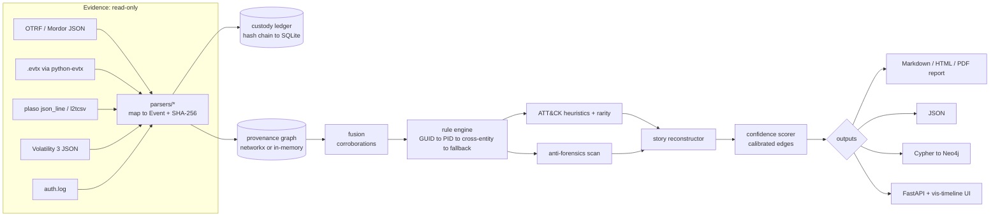

# Architecture

## Module map

| Module | Responsibility |
| --- | --- |
| `models.py` | Pydantic contracts: `Event`, `CausalEdge`, `IncidentStory`, `CustodyRecord`, `TamperingIndicator` |
| `integrity.py` | Canonical event hashing, stable ids, in-memory hash-chained ledger |
| `custody_store.py` | Append-only SQLite persistence and offline verification |
| `entities.py` | Lossy identity keys: PID, image, host, user (ADR 0003) |
| `parsers/` | One connector per artefact family; `windows.py` is the shared Windows mapper |
| `graph.py` | Temporal provenance graph with corroboration side-table |
| `fusion.py` | Same fact seen by several artefacts becomes one primary node plus corroborations |
| `rules.py` | Indexed causal rule engine and packaged per-rule calibration (ADR 0002) |
| `attack.py` | ATT&CK heuristic tags and per-case rarity, combined into event suspicion |
| `antiforensics.py` | Tampering indicators |
| `stories.py` | Story roots, subtrees, suspicion/confidence, unknown windows (ADR 0004) |
| `confidence.py` | Reliability × corroboration × temporal fit × edge strength, with tamper penalty |
| `report.py` | Court-style report (Markdown to HTML, optional WeasyPrint PDF) |
| `export.py` | JSON, Cypher and live Neo4j push |
| `api.py`, `web/` | FastAPI and a single-page timeline/graph UI |
| `reconstruct.py`, `normalize.py`, `generators.py` | v0.1 path view, legacy normaliser, synthetic scenarios |

## Trust boundaries

- Evidence is only ever **read**. The API only reads beneath
  `REVENANT_EVIDENCE_ROOT` and binds to localhost by default.
- XML from `.evtx` is parsed with `defusedxml` when available.
- Unreadable artefacts are recorded in the ledger and the report, never
  silently dropped.
