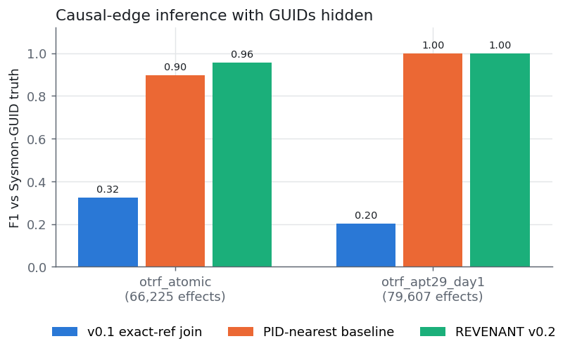
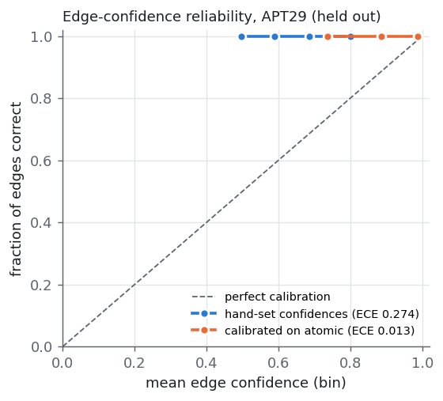
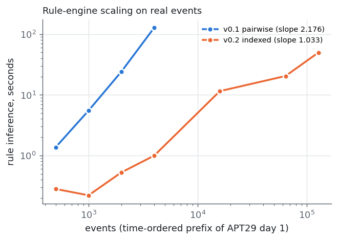

# Benchmarks & results

All numbers below are produced by the scripts in `benchmarks/` from the public corpora
described in [Datasets](datasets.md), and rendered by `python benchmarks/make_figures.py`.
The raw JSON lives in `results/*.json`; the methodology is [ADR 0006](adr/0006-benchmark-methodology.md).

!!! note "Reproduce"
    ```bash
    pip install -e '.[bench,evtx]'
    python scripts/download_data.py
    python benchmarks/bench_edges.py && python benchmarks/bench_stories.py
    python benchmarks/bench_antiforensics.py && python benchmarks/bench_scale.py
    python benchmarks/make_figures.py     # writes results/*.png and RESULTS.md
    ```

## Figures

<figure markdown>
  { loading=lazy }
  <figcaption>B1 — causal-edge F1 vs the PID-nearest baseline, per effect type.</figcaption>
</figure>

<figure markdown>
  { loading=lazy }
  <figcaption>Edge-confidence calibration: hand-set weights vs cross-corpus calibration.</figcaption>
</figure>

<figure markdown>
  { loading=lazy }
  <figcaption>B2 — story ranking hit@k vs flat timelines.</figcaption>
</figure>

<figure markdown>
  { loading=lazy }
  <figcaption>B4 — rule-engine scaling: v0.1 (quadratic) vs v0.2 (near-linear).</figcaption>
</figure>

## Full results table

--8<-- "results/RESULTS.md"
