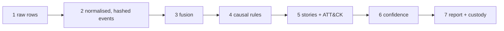

# How it works

This page follows one real capture through every stage: the committed OTRF
`otrf_psexec_lsa_secrets.jsonl` fixture (MIT, field-trimmed), in which an operator runs
Sysinternals PsExec to dump the LSA secrets registry hive. Every number below is what
`revenant analyze tests/fixtures/otrf_psexec_lsa_secrets.jsonl` produces today.



## 1. Raw rows

The capture is JSON lines exported from Windows Event Log (Sysmon, Security, System,
PowerShell). Before anything is parsed, the file itself is hashed and an `acquire` record is
appended to the custody ledger (`sha256 d4dd49a4…9b65`, identical on every platform: `.gitattributes` keeps fixtures byte-exact). A row looks like:

```json
{"SourceName":"Microsoft-Windows-Eventlog","TimeCreated":"2020-10-19 03:30:41.104",
 "Hostname":"WORKSTATION5","Channel":"Security","EventID":1102}
```

## 2. Normalised, hashed events

The parser maps 126 of the 156 rows onto the actor-action-object schema and reports the
rest as unmapped (they appear in the report's "What remains uncertain" section). Each event
gets a content hash, and its id is derived from it. Collector-local clock fields are
corrected per capture (ADR 0007): the row above was written at `03:30` collector time,
which is `07:30 UTC`.

| event | time (UTC) | source | actor → object |
|---|---|---|---|
| `ev-ae581d6f…` | 07:30:46.251 | Sysmon 1 | `cmd.exe` → `PsExec.exe -accepteula -s reg save HKLM\security\policy\secrets …` |
| `ev-16f23e0f…` | 07:30:46.435 | Sysmon 1 | `services.exe` → `PSEXESVC.exe` |
| `ev-25f1b14e…` | 07:30:46.660 | Sysmon 1 | `PSEXESVC.exe` → `reg.exe` |
| `ev-e8f40d81…` | 07:30:46.673 | Sysmon 1 | `reg.exe` → `conhost.exe` |

## 3. Fusion

Each Sysmon 1 process start has a Security 4688 twin for the same process. Fusion merges the
pair: the Sysmon record stays, the 4688 record is marked *shadowed* (so rules never link
through it twice) and becomes a **corroboration**. This capture has 8 such corroborations;
the four events above are each corroborated by `security`.

## 4. Causal rules

The indexed rule engine (ADR 0002) adds 23 typed edges. Here the Sysmon GUIDs are present,
so the GUID rules fire: `services.exe → PSEXESVC.exe → reg.exe → conhost.exe` are linked by
`guid_process_spawn` (hand-set confidence 0.97). Without GUIDs (Security 4688 only, plaso,
memory) the same links come from host + PID + image + time rules whose confidences are
**calibrated** against GUID truth (see [Evaluation](evaluation.md)).

## 5. Stories and ATT&CK

The graph is cut into incident stories (ADR 0004) and each event is scored by ATT&CK
heuristics and per-case rarity. The top story, `story-a65f65fb66`, carries
**T1003.002** (LSA secrets via `reg save`) and **T1569.002** (PsExec service), suspicion 0.87.

## 6. Confidence

Story confidence is a documented, hand-weighted sum (not a calibrated probability):

| term | weight | value |
|---|---|---|
| source reliability (Admiralty-style; Sysmon = B) | 0.3 | 0.85 |
| cross-artefact corroboration | 0.3 | 0.70 |
| temporal fit | 0.2 | 1.00 |
| edge strength (mean edge confidence) | 0.2 | 0.97 |
| tamper penalty | × | 1.00 |

0.3·0.85 + 0.3·0.70 + 0.2·1.00 + 0.2·0.97 = **0.86 → CONFIRMED** (cut-off 0.85).

## 7. Report and custody

The report cites every claim with its event id and hash, lists the two `log_cleared`
indicators (the dataset author cleared the Security and System logs before recording) and
ends with the custody head. Persist and verify it:

```bash
revenant analyze tests/fixtures/otrf_psexec_lsa_secrets.jsonl --ledger custody.sqlite --out report.md
revenant verify custody.sqlite --expect-count 129 --expect-head <"Ledger head" from the report>
```

The same case is the default in the [live demo](demo/index.html):


